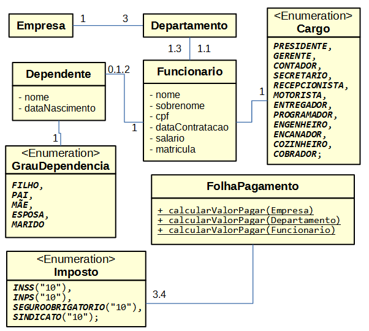

Trabalho 3 - Disciplina de Introdução a Programação Orientada a Objetos
Curso de Graduação em Sistemas para Internet - UTFPR TD.

DESCRICAO: arquivo original [aqui](pdf/exerciciosComplementares1.pdf)

Introdução à Programação Orientada a Objetos (TSI32A)
Professor: Ivan Luiz Salvadori
Trabalho 3
Atenção: Esta atividade será avaliada e corresponderá nota de acordo com o plano de ensino da disciplina.
Implemente cenários de teste para o seguinte sistema: Sistema para gerenciamento de Recursos Humanos de uma empresa. O sistema deve ser capaz de realizar cadastros de funcionários e calcular o valor a ser pago na folha de pagamentos. O sistema deve implementar o seguinte diagrama de classes:

O sistema deve garantir as seguintes regras de negócio:
1. Funcionários podem declarar no máximo 2 dependentes.
2. Não deve ser possível cadastrar dependentes declarados como FILHO com idade
superior a 18 anos.
3. Funcionários devem receber o acréscimo de 105.99 para cada dependente declarado.
4. Funcionários devem receber o acréscimo de 100.00 para cada ano completo trabalho.